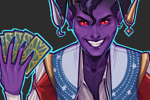
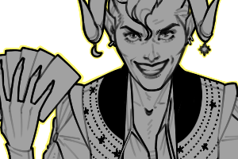
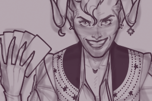

---
# Feel free to add content and custom Front Matter to this file.
# To modify the layout, see https://jekyllrb.com/docs/themes/#overriding-theme-defaults

layout: default
---

<h1>F.A.Q.</h1>

You've got questions. I've got answers.

WHAT ARE YOUR COMMERCIAL RATES?

Please contact me with any inquiries for commercial work by using the contact form below.

WHAT ARE YOUR RATES FOR PERSONAL COMMISSIONS?

My rates vary depending on the complexity of the proposed project, but the basics are as follows:

    

    
        

            <h5 class="card-title">Fully Rendered</h5>
            <ul class="list-group list-group-flush">
                <li class="list-group-item"><b>$120</b> - Full-body</li>
                <li class="list-group-item"><b>$80</b> - Waist-up</li>
                <li class="list-group-item"><b>$50</b> - Portrait</li>
            </ul>
        

    
  
    

    
        

            <h5 class="card-title">Lineart</h5>
            <ul class="list-group list-group-flush">
                <li class="list-group-item"><b>$90</b> - Full-body</li>
                <li class="list-group-item"><b>$60</b> - Waist-up</li>
                <li class="list-group-item"><b>$35</b> - Portrait</li>
            </ul>
        

    

    

    
        

            <h5 class="card-title">Sketch</h5>
            <ul class="list-group list-group-flush">
                <li class="list-group-item"><b>$75</b> - Full-body</li>
                <li class="list-group-item"><b>$45</b> - Waist-up</li>
                <li class="list-group-item"><b>$20</b> - Portrait</li>
            </ul>
        

    

All prices are per character. Fully rendered commissions have a simple background (consisting of a color gradient and some textures) included in the cost! Adding a more elaborate background/setting for your illustration will come at an additional cost (determined by the complexity of the requested background).
It probably goes without saying that personal commissions are for PERSONAL USE ONLY--please send me a message if you're interested in hiring me for commercial work!

I retain all the rights to my work.

I will usually post a low-resolution, watermarked image of the completed commission on my social media accounts.

DO YOU HAVE ANY TUTORIALS?

I have a few tutorials up on by <a href="http://itsmyfreakin.tumblr.com/tagged/tutorial" style="font-weight: 600;">tumblr</a> and <a href="http://www.youtube.com/c/JakiHong" style="font-weight: 600;">youtube</a>. If you have any questions about my process, feel free to drop me a line!

