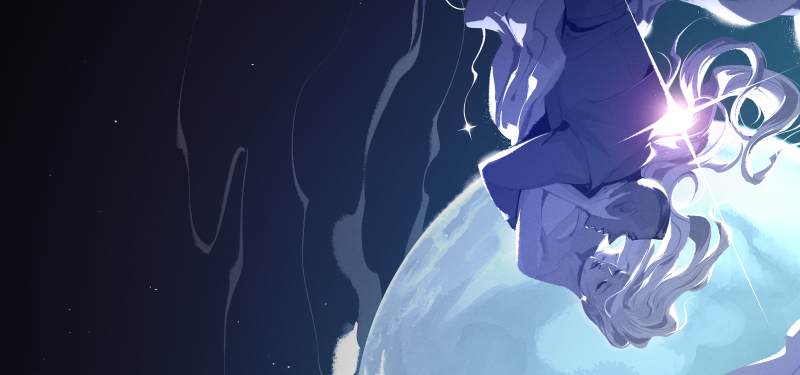
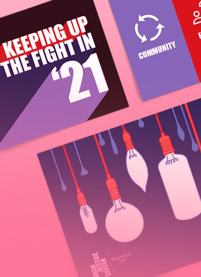
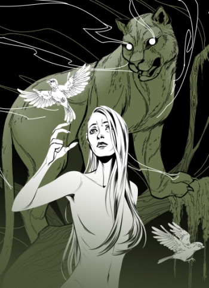
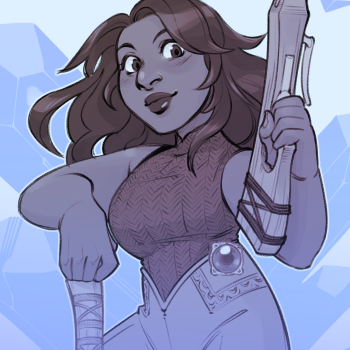
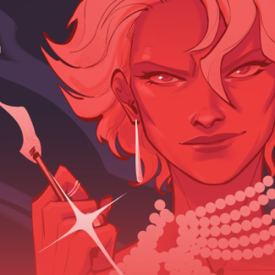
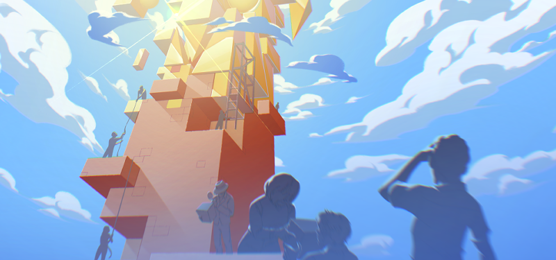
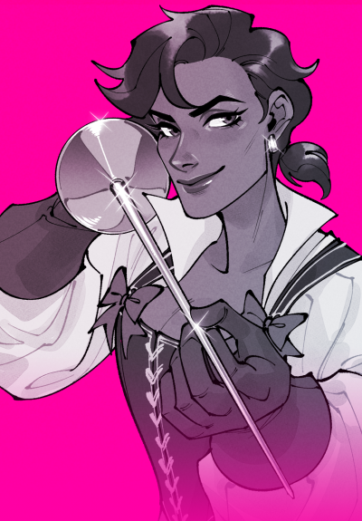
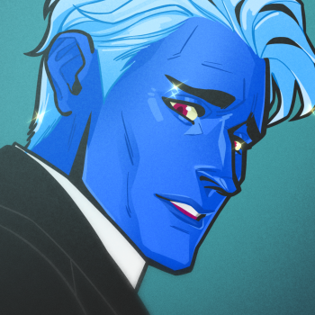
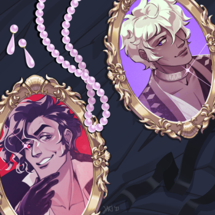
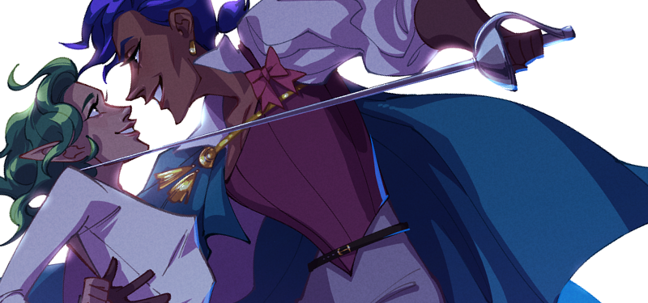

---
# Feel free to add content and custom Front Matter to this file.
# To modify the layout, see https://jekyllrb.com/docs/themes/#overriding-theme-defaults

layout: default
---

<!-- Page Content -->


  

  

    

    

      

          <ul class="list-group list-group-flush">
            <li class="list-group-item px-0">
               <h1 class="card-title">Hi!  I'm Jaki.</h1>
                <h3 class="card-subtitle MB-4">ILLUSTRATOR. DESIGNER. STORYTELLER.</h3>
                <a class="card-link" href="https://www.patreon.com/heyitsjaki"><i class="fab fa-patreon"></i></a>
                <a class="card-link" href="https://www.instagram.com/heyitsjaki/"><i class="fab fa-instagram"></i></a>
                <a class="card-link" href="https://twitter.com/heyitsjaki"><i class="fab fa-twitter"></i></a>
                <a class="card-link" href="mailto:contact@designbyjaki.com"><i class="fas fa-envelope"></i></a>
            </li>
            <li class="list-group-item px-0">
                
I'm an illustrator and designer with a passion for dynamic visual storytelling.

                
In addition to creating the webcomics <I>KISMET</I> and <I>Ladykillers</I>, I also work as a colorist and inker on <I>Lore Olympus</I>.

                <a href="../portfolio" class="card-text tiny">View my complete portfolio <i class="fas fa-arrow-right"></i></a>
            </li>
          </ul>
      

    

    <a href="http://www.kismet-comic.com">

     

      
        

          

              
Read my webcomic:

              
              
As interplanetary war threatens the perseid system, a scientist ventures to the far reaches of space in her search for the truth: is humanity the master of its own fate, or is destiny truly inescapable?

              <i class="tiny pt-5 d-none d-lg-inline" style="opacity: 0.5;">Published through Hiveworks</i>
          

        

      

    
</a>
    

      <a href="../portfolio#graphicdesign">
        

        
          

            

                <i class="tiny">Selected graphic design projects</i>
                <h2 class="pt-1 m-0">Graphic Design</h2>
            

          

        

      </a>
    

    

      <a href="../portfolio#illustration">
        

        
          

            

                <i class="tiny">Selected illustration projects</i>
                <h2 class="pt-1 m-0">Illustration</h2>
            

          

        

      </a>
    

    

      <a href="../assets/portfolio/Namesake-full.png" data-max-width="800" data-max-height="800" data-toggle="lightbox" data-gallery="commissions" data-footer="Commissioned illustration of a character from the client's comic, &#34;Namesake&#34;, (2022).">
        

        
          

            

                <i class="tiny">Selected illustrations for individual clients</i>
                <h2 class="pt-1 m-0">Commissions</h2>
            

          

        

      </a>
      

    

    

      

      
        <a href="../assets/portfolio/KISMET_Ch1_Cover.png" data-max-width="800" data-max-height="800" data-toggle="lightbox" data-gallery="KISMET" data-footer="Cover art for Chapter 1 of KISMET (2021).">
          

            

                <i class="tiny">Concept art + selected works</i>
                <h2 class="pt-1 m-0">KISMET</h2>
            

          

        </a>
        

      

    

    

      <a href="../assets/portfolio/Hilbert_Illustration.png" data-max-width="800" data-max-height="800" data-toggle="lightbox" data-gallery="Quanta" data-footer="Illustration for Quanta Magazine's article, &#34;Mathematicians Find Long-Sought Building Blocks for Special Polynomials&#34;, (2021).">
        

        
          

            

                <i class="tiny">Illustrations and design work for Quanta Magazine</i>
                <h2 class="pt-1 m-0">Quanta Magazine</h2>
            

          

        

      </a>
      

      

      

      

    

    

      <a href="../assets/portfolio/LK_trio.png" data-max-width="800" data-max-height="800" data-toggle="lightbox" data-gallery="Ladykillers" data-footer="Promotional illustrations of the protagonists from &#34;Ladykillers,&#34; (2022).">
        

        
          

            

                <i class="tiny">Concept art + selected works</i>
                <h2 class="pt-1 m-0">Ladykillers</h2>
            

          

        

      </a>
      

    

    

      <a href="../assets/portfolio/LO_05.png" data-max-width="800" data-max-height="800" data-toggle="lightbox" data-gallery="LoreOlympus" data-footer="Panel redraw from &#34;Lore Olympus,&#34; (2020).">
        

        
          

            

                <i class="tiny">Various unofficial fan works</i>
                <h2 class="pt-1 m-0">Lore Olympus</h2>
            

          

        

      </a>
      

      

      

      

    

    

      <a href="../assets/portfolio/Arcana_SW.png" data-max-width="800" data-max-height="800" data-toggle="lightbox" data-gallery="Arcana" data-footer="Fanart of Julian and Asra from the Arcana (2021).">
        

        
          

            

                <i class="tiny">Various unofficial fan works</i>
                <h2 class="pt-1 m-0">The Arcana</h2>
            

          

        

      </a>
    

    <a href="https://www.webtoons.com/en/challenge/ladykillers/list?title_no=793115">

     

      
        

          

              
Read my webcomic:

              
              
Tempers flare as two thieves compete for the ultimate prize in this exciting fantasy heist.

              <i class="tiny pt-2 d-none d-lg-block" style="opacity: 0.5;">Published through Webtoon CANVAS</i>
          

        

      

    
</a>
  

