---
# Feel free to add content and custom Front Matter to this file.
# To modify the layout, see https://jekyllrb.com/docs/themes/#overriding-theme-defaults

layout: default
---

<!-- Page Content -->

    

        <h2>Selected Works</h2>
    

    

      

        <a href="/projects/Phaedra/" class="d-block mb-3 p-1">
              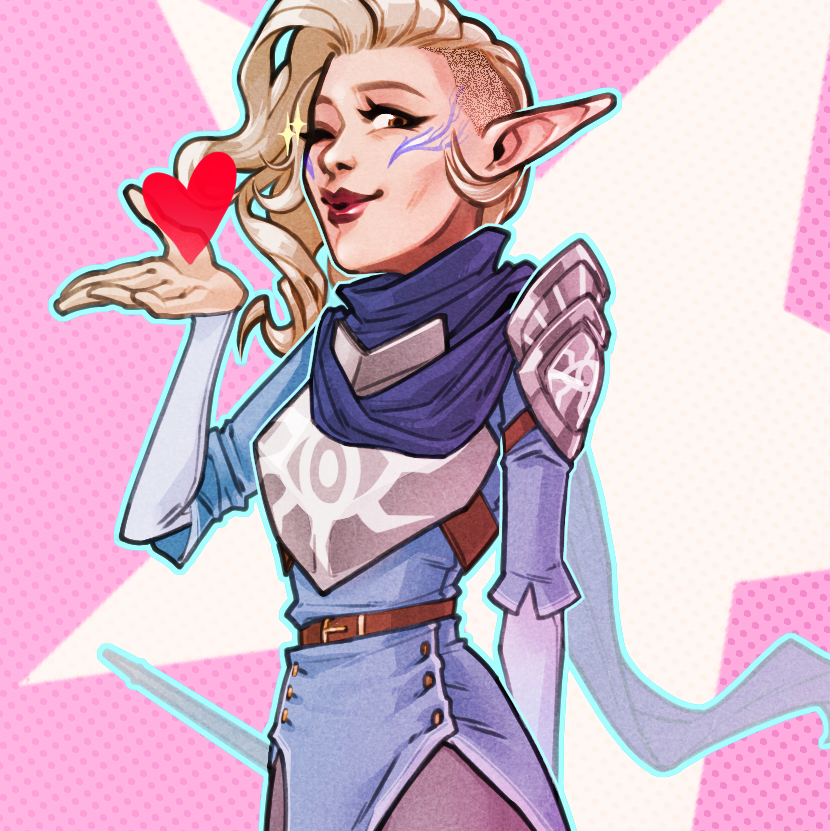
            </a>
      

      

        <a href="/projects/frozen/" class="d-block mb-3 p-1">
              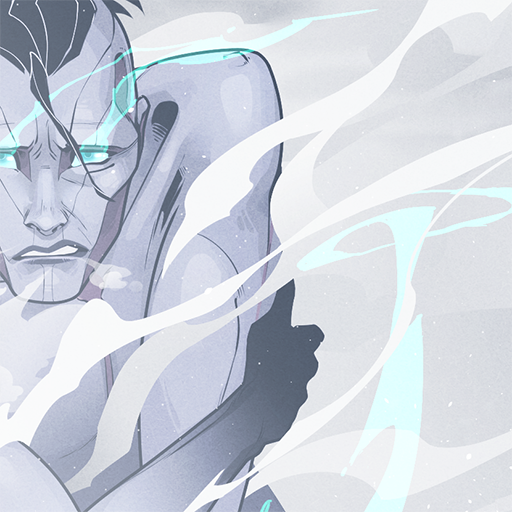
            </a>
      

      

        <a href="/projects/tertia/" class="d-block mb-3 p-1">
              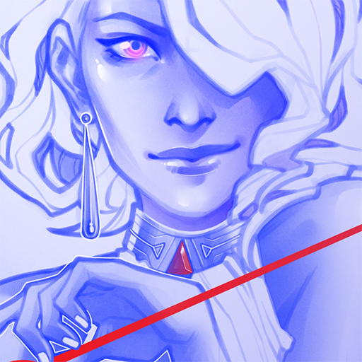
            </a>
      

      

        <a href="/projects/DVA/" class="d-block mb-3 p-1">
              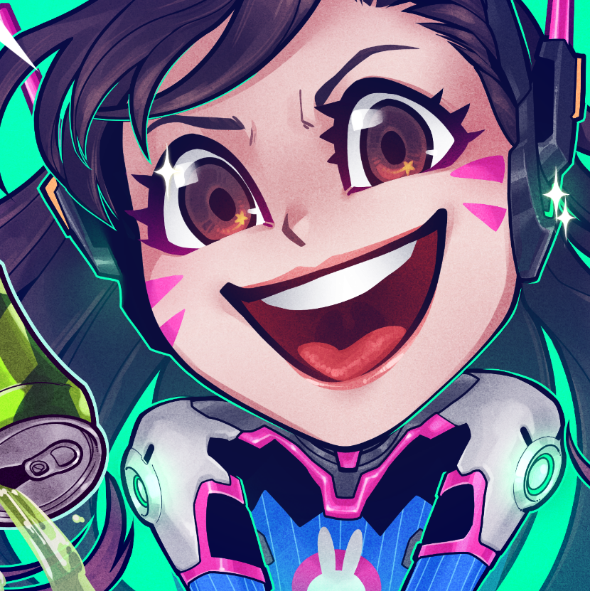
            </a>
      

      

        <a href="/projects/brewhaha/" class="d-block mb-3 p-1">
              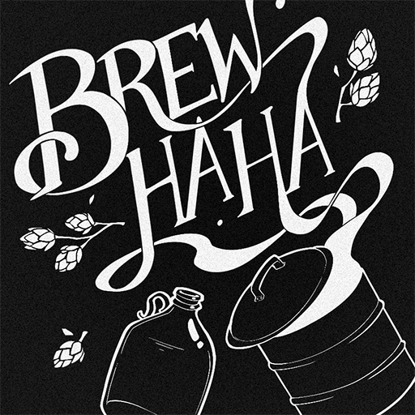
            </a>
      

      

        <a href="/projects/Cullen/" class="d-block mb-3 p-1">
              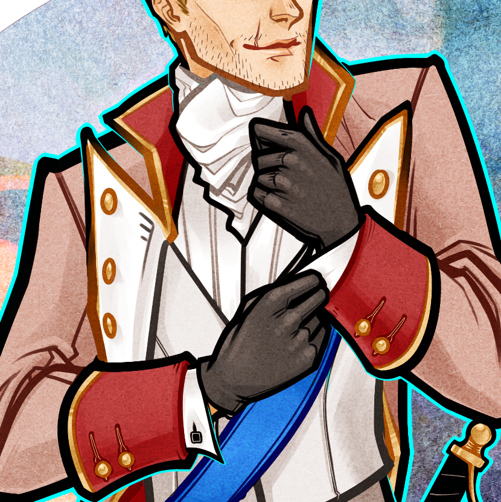
            </a>
      

      

        <a href="/projects/wordpress/" class="d-block mb-3 p-1">
              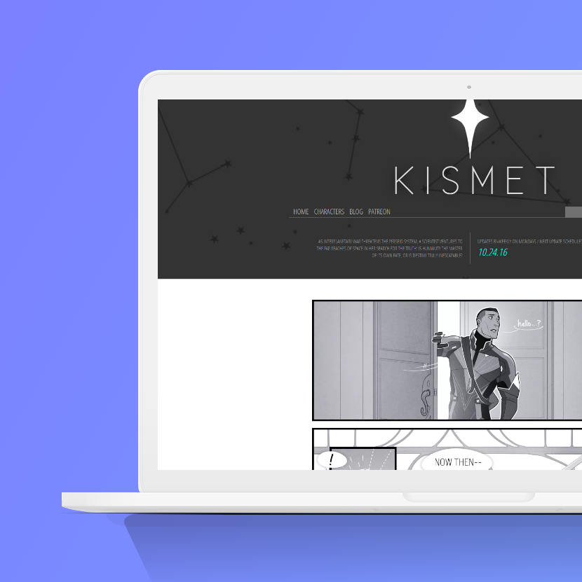
            </a>
      

      

        <a href="/projects/wgsbranding/" class="d-block mb-3 p-1">
              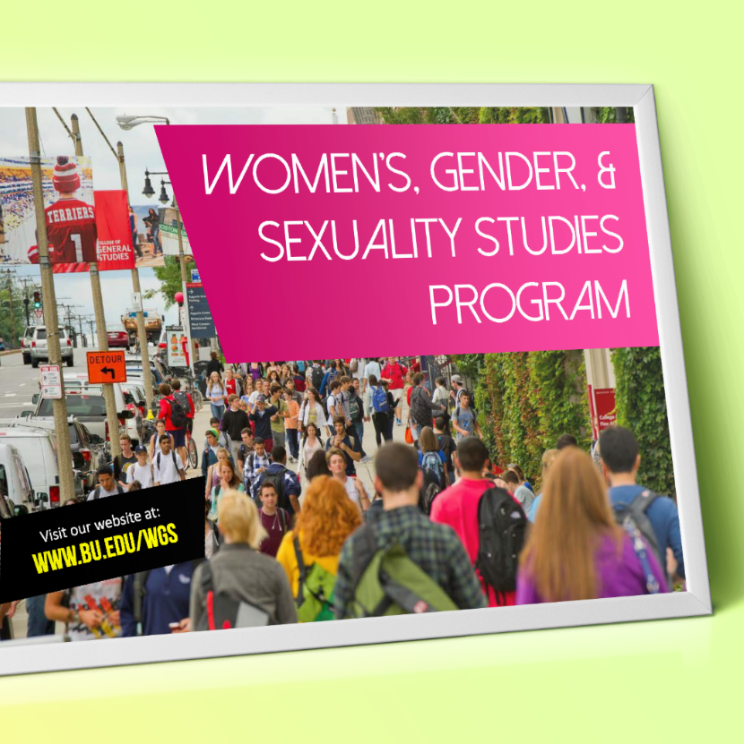
            </a>
      

      

        <a href="/projects/WS326" class="d-block mb-3 p-1">
              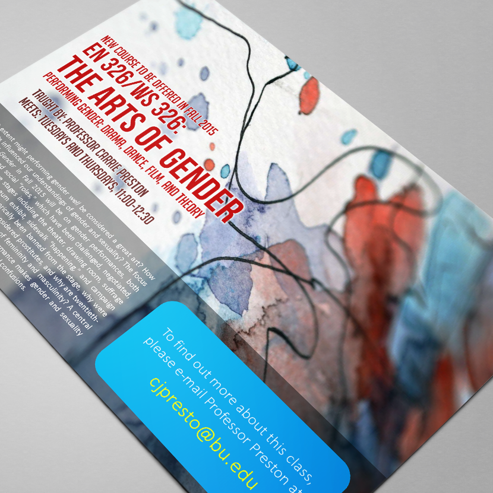
            </a>
      

      

        <a href="/projects/Dal/" class="d-block mb-3 p-1">
              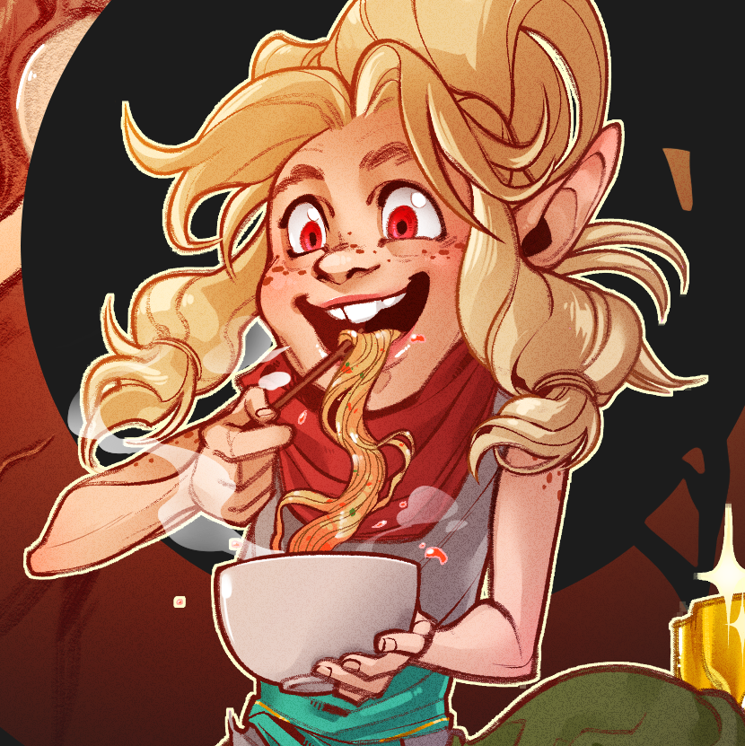
            </a>
      

      

        <a href="/projects/motivote/" class="d-block mb-3 p-1">
              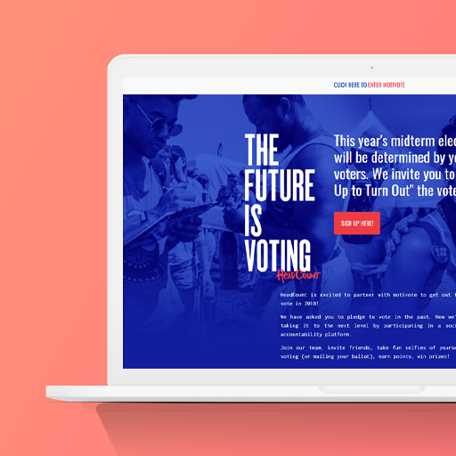
            </a>
      

      

        <a href="/projects/cover/" class="d-block mb-3 p-1">
              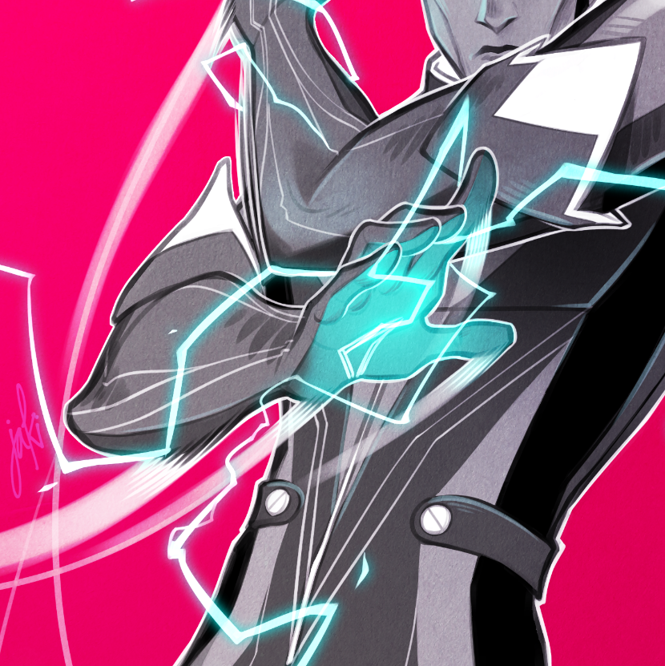
            </a>
      

    

<!-- /.container -->

<!-- jumbotron -->

<h1 class="display-4">Hi!   I'm Jaki.</h1>

I'm an illustrator and designer with over seven years of experience creating eye-catching, dynamic images and websites for academic institutions, non-profits, and individual clients.

I combine the professionalism of a senior administrator with an artist's eye for design to maximize client experience and outcomes.

My primary areas of focus include the following:

    
<a href="/portfolio#illust">
        

        <i class="fas fa-pencil-alt specialization-icon mt-3"></i>
        <h5 class="card-title mt-2">Illustration</h5>
        

        
Projects focusing on character design, costume design, and illustrative compositions.

        
Click to view more examples.

        

    </a>

<a href="/portfolio#gdesign">

<i class="fas fa-file-image specialization-icon mt-3"></i>
<h5 class="card-title mt-2">Graphic Design</h5>

Projects including event flyers, logo designs, and styled presentations.

Click to view more examples.

</a>

<a href="/portfolio#wdesign">

<i class="fas fa-desktop specialization-icon mt-3"></i>
<h5 class="card-title mt-2">Web Design</h5>

Projects including websites, blog layouts, coded using HTML and CSS.

Click to view more examples.

</a>

            

EDUCATION

Boston University | May 2011

B.A. in Economics

SPECIALIZATIONS

<LI>Branding</LI>
<li>Character Design</li>
<li>Fashion Illustration</li>
<li>Graphic Design</li>
<li>Logo Design</li>
<li>Sequential Art</li>
<li>Web Design</li>

CODING LANGUAGES

<LI>Bootstrap</LI>
<li>CSS</li>
<li>HTML</li>
<li>Jekyll</li>

SOFTWARE PROFICIENCIES

EXPERIENCE

MOTIVOTE

Freelance Web Designer | October 2018

<li>Designed and coded a landing page for MotiVote's partnership with Headcount.</li>

THE GOOD COUNTRY

Freelance Designer | September 2018

<li>Created illustrations for explainer sheet.</li>
<li>Helped design layout for 2-page spread outlining company policies.</li>

DEPARTMENT OF OCCUPATIONAL THERAPY, BOSTON UNIVERSITY

Senior Program Coordinator | October 2016 - Present

<li>Designed logos for departmental labs and groups.</li>
<li>Created graphics for Entry-level OTD Program Open House events.</li>
<li>Created event flyers and other graphics for departmental activities.</li>

KISMET

Writer and Illustrator | October 2015 - Present (On hiatus)

<li>Featured on the front page of Tapas.io and the Tapastic app.</li>
<li>2016 winner of StArt Faire’s “Excellence in Science Fiction” award.</li>
<li>Designed characters, costumes, and assets.</li>
<li>Wrote and illustrated two chapters of the comic.</li>
<li>Designed and built a website for the comic.</li>

WOMEN’S, GENDER, & SEXUALITY STUDIES PROGRAM, BOSTON UNIVERSITY

Program Coordinator | December 2013-October 2016

<li>Created branding standard for departmental marketing materials.</li>
<li>Designed the annual WGSS newsletter.</li>
<li>Created event flyers and other graphics for departmental activities.</li>
<li>Updated and maintained departmental website.</li>

CENTER FOR FINANCE, LAW, & POLICY, BOSTON UNIVERSITY

Program Coordinator | February 2012-December 2013

<li>Created event flyers and other graphics for departmental activities.</li>
<li>Updated and maintained departmental website.</li>                    

<!-- /.jumbotron-->