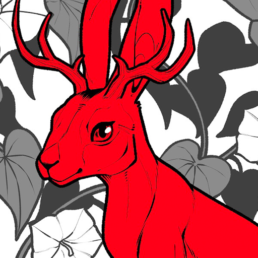
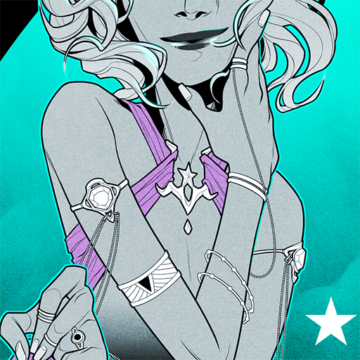
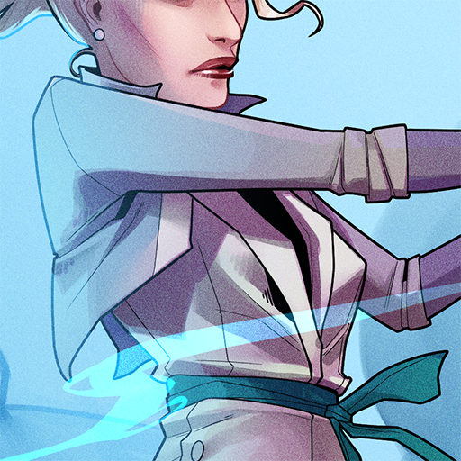
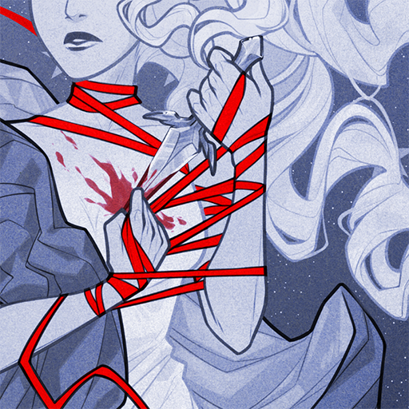
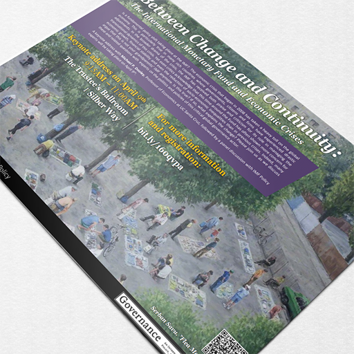
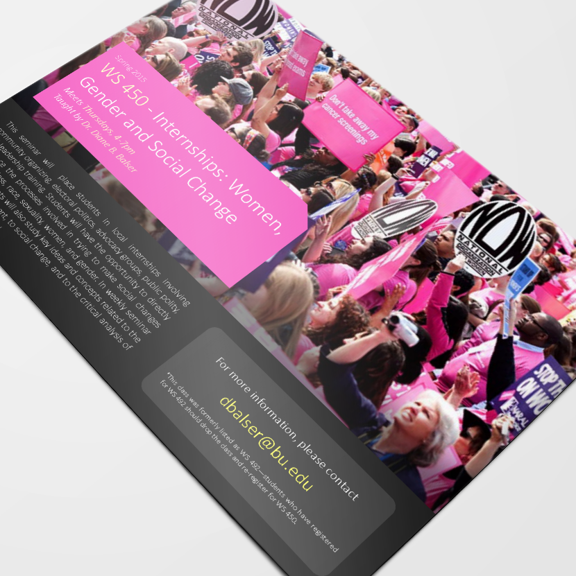
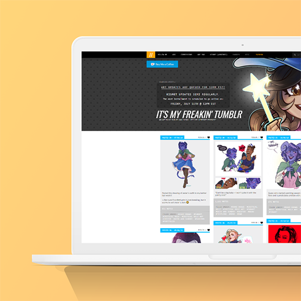

---
# Feel free to add content and custom Front Matter to this file.
# To modify the layout, see https://jekyllrb.com/docs/themes/#overriding-theme-defaults

layout: default
---
<!-- Page Content -->

        

            <h2>Illustration</h2>
            

            
Projects focusing on character design, costume design, and illustrative compositions.

            
Previous works include fanart for <I>Dragon Age: Inquisition</I>, <I>Overwatch</I>, and a number of promotional illustrations of characters from my webcomic, <a href="http://www.kismet-comic.com">KISMET</a>. Projects were completed using Clip Studio Paint and Adobe Photoshop.

            

        

        

          

            
          

          

            
          

          

            
          

          

            
          

          

            
          

          

            
          

          

            
          

          

            
          

          

            
          

          

            
          

          

            
          

          

            
          

        

    

<!-- Page Content -->

    

        <h2>Graphic Design</h2>
        

        
Projects including event flyers, logo designs, and styled presentations.

        
Previous works include promotional materials for academic events at Boston University. Projects were completed using Adobe Photoshop, Adobe Illustrator, Adobe InDesign, and Microsoft Powerpoint.

        

    

    

      

        
      

      

        
      

      

        
      

      

        
      

      

        
      

      

        
      

    

<!-- Page Content -->

        

            <h2>Web Design</h2>
            

            
Projects including websites, blog layouts, coded using HTML and CSS.

            
Previous works include personal blog and website layouts. Projects were coded with BootStrap and Jekyll for hosting on GitHub, Wordpress, and Tumblr.

            

        

        

          

            
          

          

            
          

          

            
          

        

    
